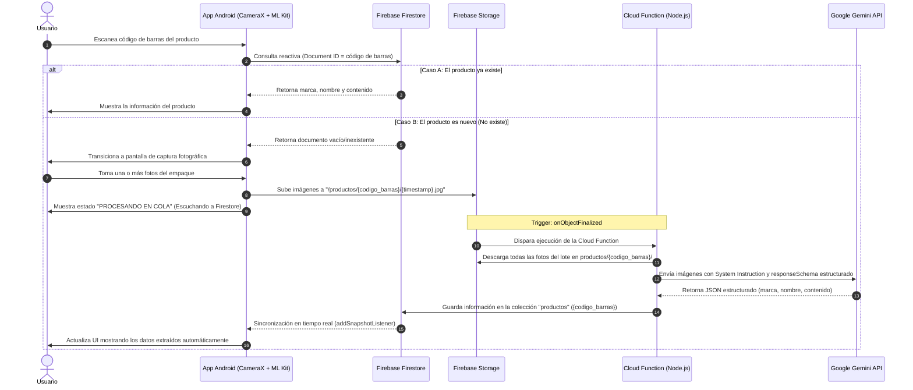

# Supermarket Inventory Scanner - POC (Prueba de Concepto)

Este proyecto es una Prueba de Concepto (POC) para automatizar el inventario de supermercados utilizando una arquitectura server-side. Consiste en una aplicación nativa de Android acoplada a un backend de Firebase (Firestore, Storage y Cloud Functions en TypeScript) e integrada con la inteligencia artificial de Gemini (modelo `gemini-2.0-flash`) para estructurar información de productos a partir de fotos del empaque de forma asíncrona.

---

## 1. Arquitectura del Sistema y Flujo de Datos

El diseño arquitectónico prioriza la eficiencia en el dispositivo móvil eliminando la inferencia pesada de IA del cliente. La aplicación móvil delega el análisis de imágenes y la estructuración de datos al backend en la nube.



---

## 2. Componentes del Proyecto

### A. Cliente Android (`/app`)
Construido utilizando prácticas modernas de desarrollo de Android:
- **Lenguaje:** Kotlin
- **UI:** Jetpack Compose (Material 3)
- **Arquitectura:** MVVM (Model-View-ViewModel) con flujos reactivos.
- **Escaneo Local:** Google ML Kit Barcode Scanning para la detección instantánea de formatos `EAN_13`, `EAN_8` y `UPC_A`.
- **Cámara:** Integración con Jetpack CameraX para el escaneo de códigos de barras y captura fotográfica en alta resolución.
- **Sincronización:** Firebase Firestore SDK (con escuchas en tiempo real vía `addSnapshotListener`) y Firebase Storage SDK para la subida asíncrona de archivos.
- **Navegación:** Jetpack Navigation3.

### B. Backend / Servidor (`/functions`)
Funciones de backend sin servidor (Serverless) configuradas en Firebase:
- **Lenguaje/Entorno:** TypeScript en Node.js (Firebase Functions v2).
- **Trigger:** Evento `onObjectFinalized` de Firebase Storage que detecta la subida completa de imágenes al directorio del producto.
- **IA Generativa:** SDK Oficial de Google Gen AI (`@google/genai`) utilizando el modelo `gemini-2.0-flash`.
- **Esquema Estricto:** Uso del parámetro `responseSchema` de Gemini para obligar al modelo a retornar un JSON estructurado que se valida y parsea directamente en el backend para evitar deudas técnicas de parseo manual de texto.

---

## 3. Estructura de Archivos del Proyecto

```text
SupermarketScanner/
├── app/                              # Módulo de la aplicación Android
│   ├── src/
│   │   ├── main/
│   │   │   ├── java/com/caucorp/supermarketscanner/
│   │   │   │   ├── data/             # Repositorios y fuentes de datos
│   │   │   │   ├── model/            # Modelos de datos (Product.kt)
│   │   │   │   ├── theme/            # Configuración de Compose Theme (Material 3)
│   │   │   │   ├── ui/               # Vistas Compose (Scanner, Capture, Detail, etc.)
│   │   │   │   └── viewmodel/        # Lógica de presentación y ViewModels
│   │   │   └── AndroidManifest.xml
│   │   └── build.gradle.kts
├── functions/                        # Módulo del Backend (Firebase Cloud Functions)
│   ├── src/
│   │   └── index.ts                  # Cloud Function de procesamiento con Gemini
│   ├── package.json
│   └── tsconfig.json
├── firestore.rules                   # Reglas de seguridad de Firestore
├── storage.rules                     # Reglas de seguridad de Firebase Storage
├── firebase.json                     # Configuración de despliegue de Firebase
└── build.gradle.kts                  # Configuración Gradle raíz del proyecto
```

---

## 4. Requisitos Previos

Para ejecutar y probar este proyecto localmente o desplegarlo a producción, se requiere:

- **Para el Cliente Android:**
  - Android Studio Koala (2024.1.1) o superior.
  - Android SDK 36 (compilación y target).
  - Dispositivo físico Android (recomendado para usar CameraX) o emulador con cámara configurada, con nivel de API 24 (Android 7.0) o superior.
- **Para el Backend:**
  - Node.js (versión 18 o 20 recomendada).
  - Firebase CLI instalado globalmente (`npm install -g firebase-tools`).
  - Una cuenta de Firebase con un proyecto activo y plan **Blaze** (requerido para utilizar Cloud Functions y llamadas a APIs externas).
  - Una **API Key de Gemini** (obtenida desde Google AI Studio).

---

## 5. Configuración y Despliegue

### Paso 1: Configurar el Proyecto de Firebase
1. Crea un proyecto en la [Consola de Firebase](https://console.firebase.google.com/).
2. Habilita **Cloud Firestore** en modo de prueba o producción.
3. Habilita **Firebase Storage**.
4. Agrega una aplicación Android a tu proyecto de Firebase usando el ID de paquete `com.caucorp.supermarketscanner`.
5. Descarga el archivo `google-services.json` y colócalo en el directorio del proyecto Android: `SupermarketScanner/app/google-services.json`.

### Paso 2: Desplegar el Backend (Cloud Functions y Reglas)
1. Inicia sesión en Firebase CLI desde tu terminal:
   ```bash
   firebase login
   ```
2. Asocia el proyecto local con tu ID de proyecto de Firebase:
   ```bash
   firebase use --add
   ```
3. Configura la clave API de Gemini como variable de entorno secreta en Firebase para la Cloud Function. Puedes hacerlo a través de la consola o mediante la configuración de secretos:
   ```bash
   firebase functions:secrets:set GEMINI_API_KEY="TU_GEMINI_API_KEY"
   ```
4. Navega al directorio de `functions` e instala las dependencias necesarias:
   ```bash
   cd functions
   npm install
   cd ..
   ```
5. Despliega las reglas de base de datos, almacenamiento y las Cloud Functions:
   ```bash
   firebase deploy
   ```

### Paso 3: Ejecutar la Aplicación Android
1. Abre el proyecto raíz `SupermarketScanner` en Android Studio.
2. Asegúrate de que el SDK de Android esté actualizado y sincroniza los archivos de Gradle.
3. Conecta tu dispositivo Android con la depuración USB activada.
4. Presiona **Run** en Android Studio para compilar e instalar la aplicación.

---

## 6. Flujo de Datos Técnico de la Cloud Function

La función `processSupermarketProduct` implementa un esquema estricto de generación estructurada con la API de Gemini:

```typescript
// System Instruction enviada a Gemini
const systemInstruction = "Eres un sistema automatizado de extracción de datos para inventarios de supermercado. Tu único objetivo es analizar una o más imágenes de un empaque de producto y extraer de forma precisa tres atributos obligatorios: la marca del fabricante, el nombre específico del producto y su gramaje o volumen neto. Debes ignorar textos promocionales, recetas, códigos internos o instrucciones de uso.";

// Estructura de esquema estricta (JSON Schema) para asegurar tipos
const responseSchema = {
  type: "OBJECT",
  properties: {
    marca: {
      type: "STRING",
      description: "La marca principal y reconocible del fabricante (ej: Soprole, Nestlé, Corcolén). Si no es visible, usar 'Genérico'."
    },
    nombre: {
      type: "STRING",
      description: "Nombre descriptivo del producto comercial, excluyendo la marca (ej: Maní Salado, Leche Entera, Arroz Grado 1)."
    },
    contenido: {
      type: "STRING",
      description: "La cantidad neta indicada en el empaque incluyendo su unidad de medida (ej: 500g, 1L, 250cc, 12 un)."
    }
  },
  required: ["marca", "nombre", "contenido"],
  additionalProperties: false
};
```

Este esquema garantiza que la salida de la Cloud Function no requiere validaciones complejas de strings ni limpieza de bloques Markdown, insertando los datos de forma robusta e inmediata en la colección de Firestore.
